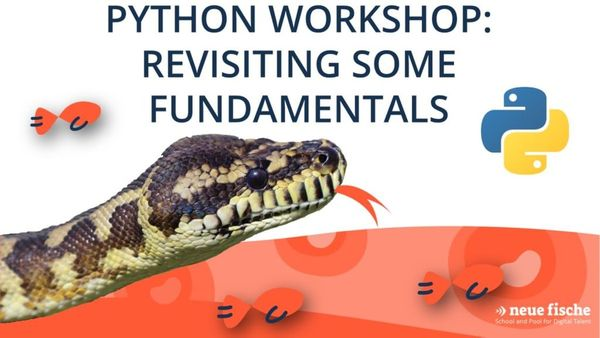

# Neuefische Meetups

This repository contains the material for our meetup workshop **"Revisiting Python Fundamentals" on 2/9/21**

This 2h workshop is aimed at people who have already gathered their first experience in python. Hopefully we can find something beneficial in pythons fundamentals that you don’t normally use because you forgot about or just never knew it existed.
In this workshop we covered three python fundamentals:

- list comprehensions
- the three ways to copy objects in Python
- generators

## Materials

We have added our [Revisit Python Fundamentals Presentation](Presentation_Revisit_Python_Fundamentals.pdf) if you would like to revisit it.

For each of the topics we have also created notebooks, that are stored in this repository.
With the links below, you can quite easily run them online in google colab.

If you want to run them locally on your computer, checkout the requirements.

### Link to List Comprehension notebook on colab

https://colab.research.google.com/github/neuefische/ds-meetups/blob/main/List-Comprehensions.ipynb

### Link to Copying in python notebook on colab

https://colab.research.google.com/github/neuefische/ds-meetups/blob/main/Copying.ipynb

### Link to Copying Exercise notebook on colab

https://colab.research.google.com/github/neuefische/ds-meetups/blob/main/Copying_Exercises.ipynb

### Link to generators and lazy evaluation

https://colab.research.google.com/github/neuefische/ds-meetups/blob/main/generators_and_lazy_evaluation.ipynb

## Requirements

If you want to run these notebooks locally, make sure you're using **Python 3**.

The required Python libraries that are needed are listed in the [requirements.txt file](requirements.txt).
