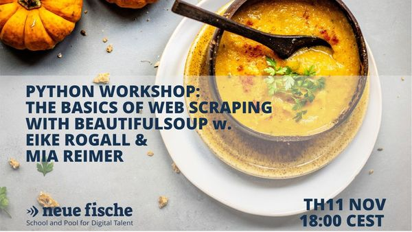

# Neuefische Meetups

This repository contains the material for our meetup workshop **"The Basics of Web Scraping with Beautiful Soup" on 11/11/21**

This 2h workshop is aimed at people who have already gathered first experiences in Python programming and want to take the first steps in the direction of Web scraping. We will give a short introduction to the basics of HTML and continue with an example of how to scrape the Web with the library Beautiful Soup.

## Materials

We have added our [Web Scraping with Beautiful Soup Presentation](Presentation_Web_Scraping_Beautiful_Soup.pdf) if you would like to revisit it.

For both topics we have also created notebooks, that are stored in this repository.
With the links below, you can quite easily run them online in google colab.

### Link to HTML Basics Notebooks

...

### Link to Web Scraping with Beautiful Soup Notebooks

...

## Requirements

If you want to run these notebooks locally, make sure you're using **Python 3**.

The required Python libraries that are needed are listed in the [requirements.txt file](requirements.txt).
